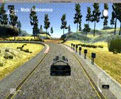

# **PID Controller**

The projects aims to implement a PID controller in C++ to maneuver the vehicle around the track! The simulator will provide the cross track error (CTE) and the velocity (mph) in order to compute the appropriate steering angle.

PID stands for Proportional Integral Derivative controller. This is a widely used closed loop feedback controller.The CTE i.e cross track error which is the lateral difference between the vehicle and reference trajectory,is the input to the controller. The PID controller takes the input CTE and produces a control signal that helps the system achieve the desired trajectory, hence minimizing the error. This is achieved by tuning the proportional,integral and derivative gains or coefficients of the controller. In order to tune these hyperparameters we need to first understand the effects of each. The below section gives a basic understanding of each of these parameters.

### P - Proportional  

Proportional component produces a control signal that is  proportional to CTE. This means higher the error bigger is the value of the signal. In simple words,if the car is to the left of the reference trajectory/middle of the road ,we would want to steer to the right. The proportion of the steering angle depends on the proportion of how far off is car on the left.This depends on the propotional gain or KP of the controller. The value of KP decides the responsiveness of the controller. If KP value is high,the system overshoots and the car may drift off the road while a low KP may give us a sluggish system.

### D - Derivative 

The Derivative component produces a control signal that is based on the rate of change of CTE. This component helps in compensating for the overshoot produced by the P component.  It smoothens out the oscillations caused by the P component. Thus the steering angle does not swing the car between right and left of the road.

### I - Integral

Integral component produces a signal based on the sum of the past CTEs. This component is useful to compensate the effect of steady errors like steering drift. This component helps to steer car around sharp curves and turns. High value of KI creates oscillations.

## Tuning Hyperparameters
Tuning of the PID coefficients was done manually. Following the flow of the lessons,I first started by tuning the P parameter. I and D coefficients were zero. I found the car oscillated a lot between right and left and then drifted outside of the road. The next parameter added was D.  P and D together gave much better response as compared to just P. The oscillations were far more less but not smooth enough. It still drifted out of road,crashed muliple times and did not complete the full course. After a lot of tweaking and tuning the parameters, I settled on the values P = 0.2 and D = 3.These values gave good performance. The car did not swing a lot,stayed around middle of the road and completed the full course of road without crashing or leaving the road. The component I was added which give a much smoother performance escpecially around sharp turns. The final values  were (P I D) = (0.2, 0.0003, 3).

##### Output for just P (1,0,0)

##### Output for  P & D (0.2,0,3)

## Output

Following GIF shows snippet from actual test run in the simulator:

##### Output for  P I D (0.2, 0.0003, 3)

Complete output video can be found here: [output_video.mp4](output_videos/pid_output.mp4)

